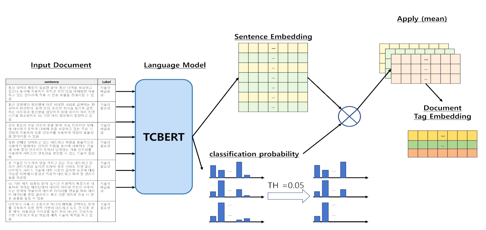

# Multi-Purpose Document Recommendation for Public Technology Commercialization



# How to create environment
```
conda env create -f tb_env.yaml
conda activate techbert
```

# How to download checkpoints
## 1. make model folder
```
mkdir model
```

## 2. download checkpoint folders
### best model
https://drive.google.com/file/d/1et7RLlDmR6MirMWZBnUQ7V6ULOuRT70N/view?usp=drive_link
### last model
https://drive.google.com/file/d/13i70jhqyMpzXO3zlnSJ_NaD1tWPQEkWz/view?usp=drive_link

## 3. unzip and move to model folder
- then, the directory structure will look like this:
```
.
├── checkpoint_download.sh
├── data
│   └── etri4rec.csv
├── doc_rec.py
├── figures
│   └── overall_figure.png
├── model
│   ├── checkpoint-12300
│   │   ├── config.json
│   │   ├── optimizer.pt
│   │   ├── pytorch_model.bin
│   │   ├── rng_state.pth
│   │   ├── scheduler.pt
│   │   ├── trainer_state.json
│   │   └── training_args.bin
│   └── checkpoint-984
│       ├── config.json
│       ├── optimizer.pt
│       ├── pytorch_model.bin
│       ├── rng_state.pth
│       ├── scheduler.pt
│       ├── trainer_state.json
│       └── training_args.bin
├── README.md
├── run_rec.sh
├── tb_env.yaml
└── vocab
    ├── tokenizer.json
    └── vocab_40000.txt

```
# How to Run
```
sh run_rec.sh
```
